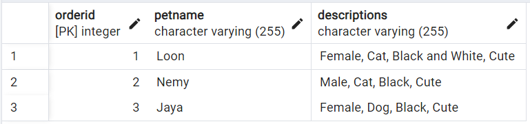
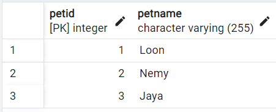
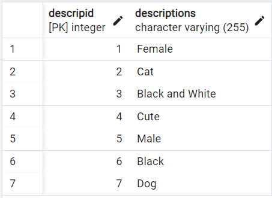
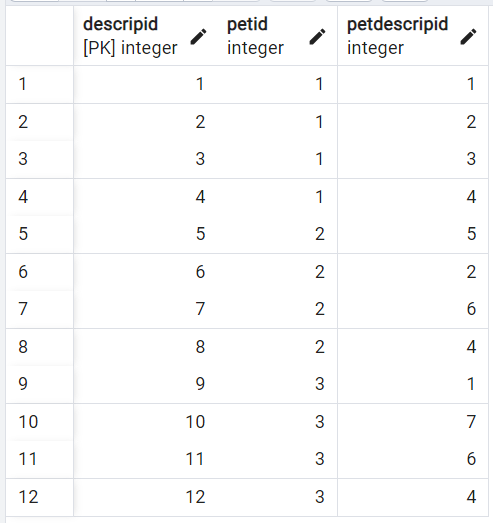

# Database Normalization using PostgreSQL with PostGIS Extension 
## Spatial Databases IDCE 376 | Assignment 2: | Clio Bate | 02/14/2024

This project was created as part of the class, Spatial Databases at Clark University Spring, 2024. The objective of this assignent is to introduce database normalization and implement these concepts by creating our own non-normal database, and normalizing it to 1NF and 2NF.  
The full assignment instructions can be found on the class website, [here](https://studyingplace.space/spatial-database/labs/A2-Database_Normalization.html)

### This repository includes
1. analysis.sql : SQL script for creating and normalizing tables
1. Report.MD (this document): A Markdown or text file containing your normalization report.
1. Screenshots showing your final table structures in pgAdmin or the command-line outputs.  
- Pets_Ive_Had_table1 = orignal table 
- Pets_table2 = lists pets with PetID as primary key
- Pets_Descrip_table3 = lists decriptions with DescripID as primary key
- Descrip_table4  = 2NF = 

In REPORT.md or REPORT.txt, explain the process and rationale behind normalizing your database to 1NF and then to 2NF. Include any challenges faced and how you addressed them.

Pets_Ive_Had = Parks_info
Parks = Pets
Pet_Descrip =ParkFacilities
Descrip = Facilities
Descriptions = FacilityName

Methods

Challenges:
- i had named all my columns descrip instead of descriptions  
- orignally named Descrip Pets_Descrip, so I had to change it 

Screneshots of tables

Para hacer antes de que yo lo entrege:
1. process and rational
2. challenges
- i had named all my columns descrip instead of descriptions and had orignally named Descrip Pets_Descrip, so I had to change it 
3. cambiar el nombre de este documento de README.md a REPORT.md
4. añadir las fotitos